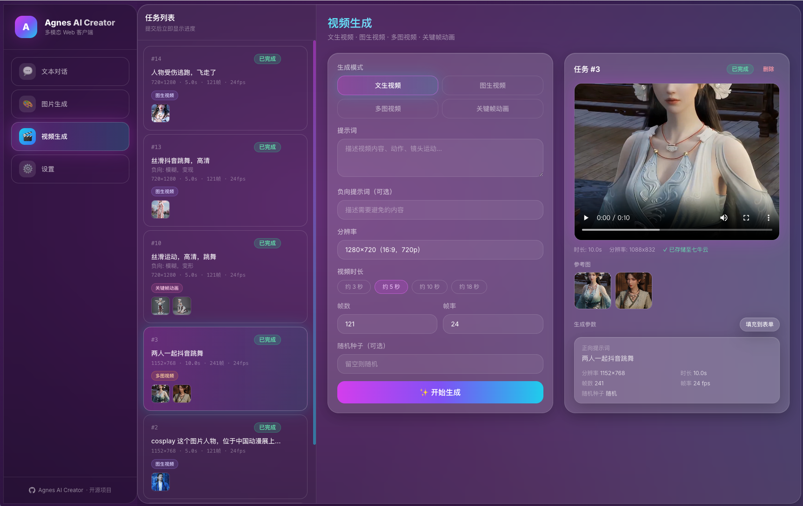
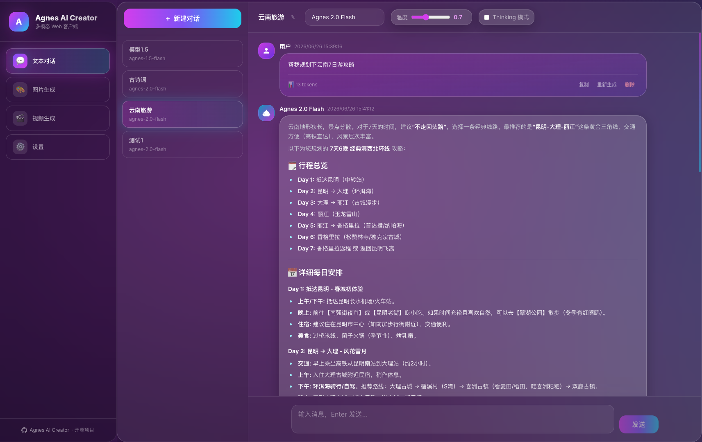
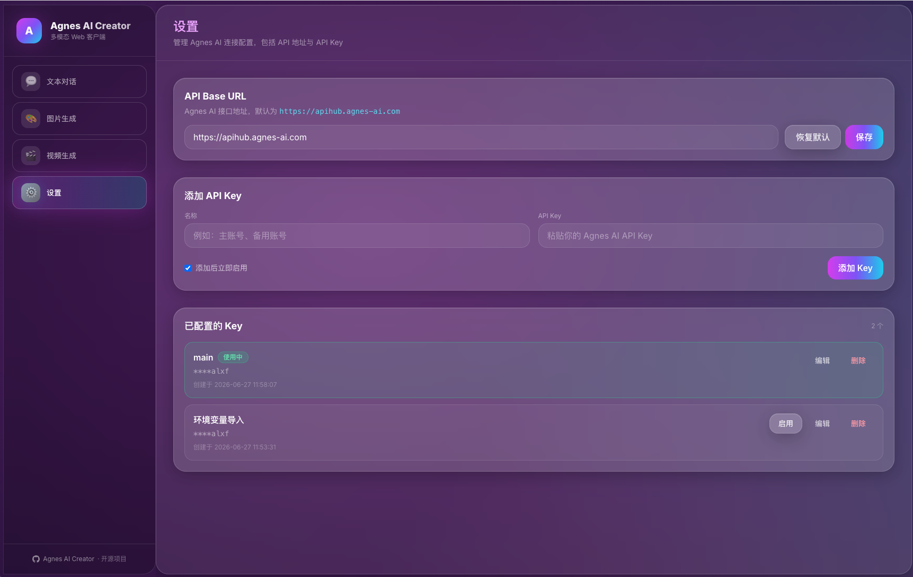

<h4 align="right"><a href="README_EN.md">English</a> | <strong>简体中文</strong></h4>
<p align="center">
  
</p>
<h1 align="center">Agnes AI Creator</h1>
<p align="center"><strong>基于 Agnes AI 免费大模型的自托管多模态 Web 客户端</strong></p>
<p align="center">AI 对话 · 文生图 / 图生图 · 文生视频 / 图生视频 </p>
<div align="center">
  <a href="https://platform.agnes-ai.com/" target="_blank">
  </a>
  <a href="https://agnes-ai.com/doc/overview" target="_blank">
  </a>
  <a href="https://www.python.org/" target="_blank">
  </a>
  <a href="https://fastapi.tiangolo.com/" target="_blank">
  </a>
  <a href="https://nextjs.org/" target="_blank">
  </a>
</div>

<p align="center">
  
</p>

<p align="center">
  <strong>对话 · 生图 · 生视频 · 一个界面全搞定</strong><br/>
</p>

## 界面预览

<table cellpadding="6">
  <tr>
    <td width="50%" align="center" valign="top">
      
      <strong>🎨 图片生成</strong><br/>
      <span style="font-size:13px">文生图 · 单图编辑 · 多图合成 · 历史回看</span>
    </td>
    <td width="50%" align="center" valign="top">
      
      <strong>🎬 视频生成</strong><br/>
      <span style="font-size:13px">文/图生视频 · 关键帧动画 · 内置播放器 · 七牛云转存</span>
    </td>
  </tr>
  <tr>
    <td width="50%" align="center" valign="top">
      
      <strong>💬 AI 对话</strong><br/>
      <span style="font-size:13px">流式输出 · Thinking 模式 · Token 统计 · 多对话切换</span>
    </td>
    <td width="50%" align="center" valign="top">
      
      <strong>⚙️ 网页设置</strong><br/>
      <span style="font-size:13px">API Key / Base URL 可视化配置 · 多 Key 管理 · 即改即用</span>
    </td>
  </tr>
</table>

## 功能特性

| 模块 | 能力 |
|------|------|
| **文本对话** | 新建 / 切换对话、流式输出、Thinking 模式、Token 与耗时统计 |
| **图片生成** | 文生图、单图编辑、多图合成；多模型支持 |
| **视频生成** | 文生视频、图生视频、多图视频、关键帧动画；后台异步轮询任务状态 |
| **媒体存储** | 图片 / 视频生成结果自动转存七牛云，持久化历史记录 |
| **网页设置** | 可视化配置 API Base URL、多 Key 管理与切换，无需改代码或重启 |

### 支持的模型

| 类型 | 模型 |
|------|------|
| 文本 | `agnes-2.0-flash`、`agnes-1.5-flash`（已弃用） |
| 图片 | `agnes-image-2.0-flash`、`agnes-image-2.1-flash` |
| 视频 | `agnes-video-v2.0` |

## 技术栈

- **前端**: Next.js 15（App Router）· React 19 · TypeScript · Tailwind CSS
- **后端**: Python 3 · FastAPI · httpx · APScheduler
- **数据库**: SQLite（零配置，首次启动自动建表，SQL 文件在 backend/sql 文件夹里）
- **对象存储**: 七牛云（可选）
- **AI 接口**: [Agnes AI OpenAI 兼容 API](https://agnes-ai.com/doc/overview)

## 环境要求

- Python 3.10+
- Node.js 18.18+
- [Agnes AI API Key](https://platform.agnes-ai.com/)（免费申请，在网页 **设置** 中配置）
- 七牛云对象存储（可选，用于持久化保存生成结果）

## 快速开始

### 1. 克隆项目

```bash
git clone https://github.com/jiyiren/agnes-ai-creator.git
cd agnes-ai-creator
```

### 2. 配置后端环境变量（可选）

七牛云与数据库路径通过 `backend/.env` 配置；**Agnes AI 的 API Key 与 Base URL 在网页设置中管理**，无需写入 `.env`。

```bash
cp backend/.env.example backend/.env
```

编辑 `backend/.env`：

| 变量 | 必填 | 说明 |
|------|------|------|
| `STORAGE_PROVIDER` | 否 | 存储 Provider：`none` / `qiniu` / `s3`，默认 `none` |
| `QINIU_ACCESS_KEY` | 否 | 七牛云 Access Key |
| `QINIU_SECRET_KEY` | 否 | 七牛云 Secret Key |
| `QINIU_BUCKET` | 否 | 存储桶名称 |
| `QINIU_DOMAIN` | 否 | CDN 访问域名，如 `https://xxx.example.com` |
| `QINIU_REGION` | 否 | 存储区域，默认华东 `z0` |
| `AWS_REGION` | 否 | S3 bucket 区域，如 `ap-southeast-1` |
| `AWS_S3_BUCKET` | 否 | S3 存储桶名称 |
| `AWS_S3_PREFIX` | 否 | S3 对象前缀，默认 `agnes-ai` |
| `AWS_S3_PUBLIC_BASE_URL` | 否 | CloudFront / 自定义 CDN 域名（可选） |
| `AWS_S3_ENDPOINT_URL` | 否 | S3 兼容存储 endpoint（AWS S3 留空） |
| `AWS_ACCESS_KEY_ID` | 否 | S3 Access Key（推荐用 IAM Role） |
| `AWS_SECRET_ACCESS_KEY` | 否 | S3 Secret Key（推荐用 IAM Role） |
| `AWS_SESSION_TOKEN` | 否 | 临时会话 Token（可选） |
| `DATABASE_PATH` | 否 | SQLite 路径，默认 `./database/aimodel.db` |

> 未配置对象存储（`STORAGE_PROVIDER=none`）时，AI 生成功能仍可用，但媒体可能不会持久化到对象存储。

### 3. 启动后端

建议使用虚拟环境，避免与系统 Python 包冲突：

```bash
cd backend
python3 -m venv .venv
source .venv/bin/activate   # Windows: .venv\Scripts\activate
pip install -r requirements.txt
uvicorn app.main:app --reload --host 0.0.0.0 --port 8000
```

### 4. 启动前端

```bash
cd frontend
npm install
npm run dev
```

### 前端环境变量

Next.js 前端通过以下环境变量配置（放在 `frontend/.env` 或部署环境中）：

```env
NEXT_PUBLIC_SITE_URL=https://your-domain.com
BACKEND_URL=http://127.0.0.1:8000
```

| 变量 | 必填 | 说明 |
|------|------|------|
| `NEXT_PUBLIC_SITE_URL` | **生产环境必填** | 站点对外访问的完整域名（如 `https://your-domain.com`）。用于生成 canonical、OpenGraph URL、sitemap 与 robots Sitemap。开发环境未设置时回退到 `http://localhost:3000`；**生产环境未设置会直接构建失败**，防止把 localhost 泄漏到 SEO 输出。 |
| `BACKEND_URL` | 部署时必填 | Next.js Node Server 转发 `/api/*` 时连接的后端 FastAPI 地址，默认 `http://127.0.0.1:8000`。 |

> 注意：Agnes AI 的 API Key 等敏感信息只应保存在后端（`backend/.env` 或网页设置），**不要**放入 `NEXT_PUBLIC_*` 前缀的环境变量，否则会暴露到浏览器端。

### 5. 首次使用：配置 Agnes AI

浏览器访问 [http://localhost:3000](http://localhost:3000)，进入应用侧边栏 **设置** 页面：

<p align="left">
  
</p>

1. **API Base URL**：默认为 `https://apihub.agnes-ai.com`，一般无需修改
2. **添加 API Key**：填写名称与 Key，勾选「添加后立即启用」
3. 可添加多个 Key，随时切换「使用中」的 Key

配置完成后即可使用对话、图片、视频功能。

Next.js 前端会将浏览器端的 `/api/*` 请求代理到后端的 `http://127.0.0.1:8000`（可通过 `BACKEND_URL` 环境变量覆盖）。浏览器始终只访问 `/api/*`，不感知后端地址。

## 生产部署

> 部署架构说明：本项目**不是**「静态构建 → Nginx 托管 dist」的传统 SPA 部署。前端是 Next.js Node Server（`next start`），需要常驻进程运行：

```text
Browser
  ↓
Reverse Proxy (Nginx / Caddy / Traefik)
  ├── /api/* → FastAPI (http://127.0.0.1:8000)
  └── /*     → Next.js Node Server (next start, 默认 3000)
```

或直接让 Next.js Node Server 的 `/api/*` rewrite 转发到 `BACKEND_URL`，反向代理只负责把流量交给 Next.js 即可。

### 构建

```bash
# 构建 Next.js 生产包（生产环境必须设置 NEXT_PUBLIC_SITE_URL）
cd frontend
NEXT_PUBLIC_SITE_URL=https://your-domain.com BACKEND_URL=http://127.0.0.1:8000 npm run build

# 后端以生产模式运行（建议在 venv 中）
cd backend
source .venv/bin/activate
uvicorn app.main:app --host 0.0.0.0 --port 8000
```

### 运行

```bash
cd frontend
npm run start   # Next.js Node Server，默认端口 3000
```

前端以 Next.js 方式部署，常驻 Node Server；反向代理将 `/*` 转发到 Next.js，将 `/api/*` 转发到 FastAPI（或直接由 Next.js 的 `/api/*` rewrite 转发到 `BACKEND_URL`）。

## Docker 部署

> 前置条件：一台安装 Docker（含 Compose 插件）的 Linux 服务器。整个项目（前端 + 后端 + SQLite）通过 `docker compose up -d --build` 一键启动。

```text
Browser
   ↓
Next.js :3000   （对外）
   ↓ /api/* （服务端 rewrite，浏览器不感知后端地址）
FastAPI :8000   （仅内部，不对外暴露）
   ↓
Agnes AI API

FastAPI
   ↓
SQLite 持久化 volume（/data）
```

### 1. 复制环境变量

```bash
cp .env.example .env
```

### 2. 修改配置

至少需要配置：

| 变量 | 必填 | 说明 |
|------|------|------|
| `NEXT_PUBLIC_SITE_URL` | **是** | 站点对外访问的完整 URL，如 `https://ai.example.com`。用于 SEO canonical / OpenGraph / sitemap。 |
| `AGNES_API_KEY` | 否* | 数据库为空时，作为初始 API Key 自动导入。*也可跳过，事后在网页「设置」中添加。 |
| `STORAGE_PROVIDER` | 否 | `none` / `qiniu` / `s3`，默认 `none`。 |
| `QINIU_*` | 否 | 七牛云对象存储（`STORAGE_PROVIDER=qiniu` 时使用），不配则跳过转存。 |
| `AWS_*` | 否 | AWS S3 对象存储（`STORAGE_PROVIDER=s3` 时使用），凭据可选，推荐 IAM Role。 |

其余变量（`BACKEND_URL=http://backend:8000`、`DATABASE_PATH=/data/app.db`）已给出容器内正确默认值，一般无需修改。

### 3. 构建启动

```bash
docker compose up -d --build
```

### 4. 查看状态

```bash
docker compose ps
```

### 5. 查看日志

```bash
docker compose logs -f
# 或只看单个服务
docker compose logs -f frontend
docker compose logs -f backend
```

详细的日志查询与故障排查方法见下文 [日志与故障排查](#日志与故障排查)。

### 6. 停止

```bash
docker compose down
```

### 7. 更新代码后重新部署

```bash
git pull
docker compose up -d --build
```

### 数据说明（重要）

- `docker compose down` **不会删除** SQLite 数据 —— 数据保存在命名卷 `backend_data` 中。
- `docker compose down -v` **会删除** volume 中的数据（数据库、API Key、历史记录），**请谨慎执行**。

### 首次使用

启动后访问 `http://服务器IP:3000`，进入应用侧边栏 **设置** 页面，添加并启用 Agnes AI API Key 即可使用（若已配置 `AGNES_API_KEY` 则会自动导入）。

---

## 版本发布、更新与回滚

> 目标：**版本化发布（SemVer）+ 手动检查更新 + 手动执行更新 + SQLite 备份 + 真实健康检查 + 失败自动回滚 + 可人工回滚**。
> 默认**禁止无人值守自动升级**生产；任何生产升级前必须有 SQLite 备份；任何新版本必须通过真实 Health Check 才判定成功；任何升级失败都有明确、可验证的回滚路径。

### 版本与镜像

- 根目录 `VERSION` 记录当前 SemVer（如 `1.1.0`）。
- Docker 镜像使用明确版本 tag，禁止依赖 `latest` 升级/回滚：

```text
ghcr.io/jadelike-wine/enova-video-frontend:v1.2.0
ghcr.io/jadelike-wine/enova-video-backend:v1.2.0
```

- 额外提供 `latest` 与 `sha-<commit>` tag，仅用于不分意版本的快速拉取，生产更新/回滚一律用明确版本或 digest。
- 构建时注入 `APP_VERSION` / `GIT_SHA` / `BUILD_TIME`，后端可通过接口查询。

### 发布一个版本

```bash
git tag v1.2.0
git push origin v1.2.0
```

推送 `v*` tag 会触发 GitHub Actions `release.yml`：编译测试 → 登录 GHCR → 构建并推送 backend/frontend（`linux/amd64` + `linux/arm64`）→ 生成 `release.json`（版本 / Git SHA / 镜像 / digest）→ 创建 GitHub Release。

### 检查更新（手动）

进入 **设置 → System Update → Check for Updates**。页面只做「检查」，绝不自动升级。后端接口：

```http
GET /api/system/update/check
```

```json
{
  "current_version": "1.1.0",
  "latest_version": "1.2.0",
  "update_available": true,
  "published_at": "...",
  "release_notes": "...",
  "release_url": "...",
  "channel": "stable"
}
```

默认只检查 **stable** release，忽略 `draft` / `prerelease`。GitHub API 故障只影响本次检查（`UPDATE_CHECK_FAILED`），不影响主应用。

### 升级到最新 stable

```bash
./scripts/update.sh
```

### 升级到指定版本

```bash
./scripts/update.sh v1.2.0
```

### 只查看升级计划（不修改任何东西）

```bash
./scripts/update.sh --dry-run
```

升级流程（任一步失败即中止，旧版本继续运行）：

```text
lock → 确定目标版本 → 预检(Docker/Compose) → 当前健康检查
→ SQLite 一致性备份 → 保存 deployment state → pull 新镜像
→ 校验 digest → 切换 APP_VERSION → docker compose up -d --no-build
→ 全链路健康检查(backend /health + frontend / + frontend /api/health)
→ 成功记录；失败自动回滚
```

### 代码回滚（推荐，保留当前数据库）

```bash
./scripts/rollback.sh --code-only
```

只回滚 frontend/backend 到上一个成功版本，**不**改动数据库（避免丢失新数据）。

### 完整回滚（代码 + 恢复旧数据库）

```bash
./scripts/rollback.sh --restore-db
```

会恢复 pre-update SQLite 备份，**会删除备份时间点之后产生的所有新数据**，脚本会要求确认。

> **数据丢失风险**：`--restore-db` 会把数据库恢复到升级前快照。新版本已运行一段时间并产生新数据时，请优先使用 `--code-only`。

### 更新 / 回滚日志

所有 update/rollback 都带唯一 `update_id`，日志同时输出 stdout 并保存到 `.deploy/logs/`：

```bash
ls -lah .deploy/logs/
```

失败时自动保存失败版本的 Docker 日志（`--tail=500`），回滚后仍可调查。

### 部署状态

`.deploy/` 保存 `state.json`（previous/current 版本与 digest、备份路径、update_id）、`history.json`、`version.env`（仅 `APP_VERSION`，与 `.env` 中的 Secret 分离）、`update.lock`。**绝不存 Secret**。

### 生产 Compose

生产使用 GHCR 镜像，版本从 `.deploy/version.env` 注入：

```bash
docker compose -f docker-compose.prod.yml up -d --no-build
```

禁止 `docker compose down -v` 与 `docker system prune -a`。

### GitHub Actions 手动部署 / 回滚

`deploy.yml` 仅允许 `workflow_dispatch` 手动触发（不随 push 自动部署生产），通过 SSH 调用服务器脚本：

```text
deploy  → cd $DEPLOY_PATH && ./scripts/update.sh [v1.2.0]
rollback→ cd $DEPLOY_PATH && ./scripts/rollback.sh --code-only
```

需要配置 GitHub Secrets（`deploy.yml` 中引用）：`DEPLOY_HOST` / `DEPLOY_PORT` / `DEPLOY_USER` / `DEPLOY_SSH_KEY` / `DEPLOY_PATH`。生产 Deploy 使用 `environment: production`（可配置 Required Reviewers 人工审批）。

### 服务器需要哪些配置

- Docker（含 Compose 插件）、能访问 GHCR。
- 克隆仓库到 `DEPLOY_PATH`，`cp .env.example .env` 并填写 Agnes / AWS / 七牛等配置。
- GitHub 仓库为 private 时，后端需 `GITHUB_TOKEN`（最小权限 `read:packages`/`read:releases`）用于检查更新；GHCR 镜像为 private 时，服务器需 `docker login ghcr.io` 并配置只读 token。
- 更新脚本内置锁（flock，macOS 开发机回退为 mkdir 原子锁），update 与 rollback 互斥。

---

## 日志与故障排查

应用日志（backend / frontend）统一输出到 **stdout / stderr**，不写入容器内 `.log` 文件，因此直接用 `docker compose logs`（或 `docker logs <container>`）即可查看，无需进入容器。

### 日志配置

通过根目录 `.env` 控制（默认值见 `.env.example`）：

| 变量 | 说明 | 默认 |
|------|------|------|
| `LOG_LEVEL` | `DEBUG` / `INFO` / `WARNING` / `ERROR` / `CRITICAL` | `INFO` |
| `LOG_FORMAT` | `text`（人读）/ `json`（接 CloudWatch / Loki / ELK） | `text` |
| `LOG_PROMPTS` | 是否把用户 prompt 写入日志 | `false` |
| `ACCESS_LOG` | 是否输出请求级 access 日志 | `true` |

排障时想获得更详细日志，改 `.env` 后重建即可：

```bash
LOG_LEVEL=DEBUG
docker compose up -d --build backend
```

> `DEBUG` 仅为排障使用，生产不建议默认开启。即使 `DEBUG`，**敏感信息脱敏始终生效**，不会输出完整 API Key / AWS Secret。

### 日志滚动

`docker-compose.yml` 已为 backend / frontend 配置 `json-file` 驱动，**20MB × 5 个文件/容器**，防止详细日志无限吃满磁盘。滚动只影响本地 Docker 日志文件，不影响 `docker compose logs` 的使用。

### 常用日志查询命令

```bash
# 所有服务日志（跟随）
docker compose logs -f

# 只看 backend / frontend
docker compose logs -f backend
docker compose logs -f frontend

# 最近 200 行
docker compose logs --tail=200 backend

# 带时间戳
docker compose logs -f -t backend

# 按 Request ID 查询整次调用链
docker compose logs backend | grep "abc123"

# 按视频 Task ID 查询整个生成生命周期
docker compose logs backend | grep "task_id=xxx"

# 查 S3 相关日志
docker compose logs backend | grep -i "s3"

# 只查错误
docker compose logs backend | grep "ERROR"

# 若 LOG_FORMAT=json，可用 jq 过滤
docker compose logs backend | jq -c 'select(.level=="ERROR")'
```

### 如何定位常见问题

| 现象 | 重点搜索字段 / 特征 |
|------|----------------------|
| Agnes 401（Key 无效/过期） | `error_code=AGNES_UNAUTHORIZED` 或日志中 `status=401` |
| Agnes 429（限流） | `error_code=AGNES_RATE_LIMITED` 或 `status=429`、`retry_after` |
| Agnes 超时 | `error_code=AGNES_TIMEOUT`、`type=timeout`、`retry_count` |
| S3 权限不足 | `error_code=S3_ACCESS_DENIED`、`status=403`、`provider=s3` |
| S3 桶不存在 | `error_code=S3_UPLOAD_FAILED`、AWS 报错 `NoSuchBucket` |
| S3 连接失败 | `provider=s3` + `ConnectTimeoutError` / `EndpointConnectionError` |
| 七牛上传失败 | `provider=qiniu` + `error_code=QINIU_UPLOAD_FAILED` |
| SQLite 权限/写入失败 | `database` logger + `PermissionError` / `operational error`、`DATABASE_PATH` 不可写 |
| 视频 poller 停止 | `video.poller` 日志消失、`Scheduler Video poller scheduler started` 缺失 |
| backend 未健康 | `docker compose ps` 中 backend 不是 healthy；查 `health` 相关日志 |
| frontend 无法代理 backend | frontend 日志中 `upstream` / `ECONNREFUSED` / `502` |

### Request ID 与 Task ID 追踪

- 每个 HTTP 请求都带 `request_id`（前端生成并透传 `X-Request-ID`，后端也自动生成），响应头 `X-Request-ID` 回传，错误响应体包含 `request_id` 与 `error_code`。
- 图片 / 视频生成任务额外记录 `task_id`（数据库任务 ID），视频轮询用 `task_id` 串联整个生命周期：提交 → 轮询 → 完成/失败 → 下载 → 存储 → 入库。

```bash
# 拿到网页报错里的 Request ID 后，一键定位整条调用链
docker compose logs backend | grep "9fd8ab"
```

---

> 默认仅对外暴露 `3000`（前端）；后端 `8000` 仅作为内部端口供前端访问，不对外网公开。如需调试后端，可临时在 `docker-compose.yml` 的 `backend` 服务上增加 `ports: - "8000:8000"`，调试完请移除。

## API 文档

后端启动后访问 [http://localhost:8000/docs](http://localhost:8000/docs) 查看 Swagger 文档。

### 设置相关接口

| 方法 | 路径 | 说明 |
|------|------|------|
| GET | `/api/settings/status` | 配置状态（是否有启用 Key、Base URL 等） |
| GET | `/api/settings/base-url` | 获取 API Base URL |
| PUT | `/api/settings/base-url` | 更新 API Base URL |
| GET | `/api/settings/api-keys` | 列出所有 API Key（脱敏） |
| POST | `/api/settings/api-keys` | 添加 API Key |
| PATCH | `/api/settings/api-keys/{id}` | 编辑名称或 Key |
| POST | `/api/settings/api-keys/{id}/activate` | 启用指定 Key |
| DELETE | `/api/settings/api-keys/{id}` | 删除 Key |

### 系统信息 / 更新检查接口

| 方法 | 路径 | 说明 |
|------|------|------|
| GET | `/api/system/version` | 当前版本 / Git SHA / 构建时间 |
| GET | `/api/system/update/check` | 手动检查最新 stable 版本（只读，不升级） |

## 数据库

- 建表 SQL：`backend/sql/schema.sql`
- 默认数据库文件：`backend/database/aimodel.db`
- 首次启动时自动初始化

主要数据表：

| 表名 | 用途 |
|------|------|
| `conversations` / `messages` | 对话与消息记录 |
| `image_tasks` / `video_tasks` | 图片 / 视频生成任务 |
| `uploads` | 上传文件记录 |
| `api_keys` | Agnes AI API Key 配置 |
| `app_settings` | 应用级配置（如 Base URL） |

## 七牛云存储路径

| 类型 | 路径 |
|------|------|
| 图片 | `data/img/` |
| 视频 | `data/video/` |
| 文档 | `data/document/` |
| 其他 | `data/other/` |

## AWS S3 存储

Agnes AI Creator 支持使用 **AWS S3**（或任何 S3 兼容存储）作为对象存储，与七牛云/不转存三种模式通过 `STORAGE_PROVIDER` 统一切换。业务代码只依赖统一的 Storage 层，不感知底层是七牛还是 S3。

### 使用 Access Key 的本地 Docker 部署

在根目录 `.env` 中配置：

```bash
STORAGE_PROVIDER=s3
AWS_REGION=ap-southeast-1
AWS_S3_BUCKET=my-bucket
AWS_ACCESS_KEY_ID=你的AccessKey
AWS_SECRET_ACCESS_KEY=你的SecretKey
```

### EC2 / ECS / EKS 使用 IAM Role 部署（推荐生产）

**无需在 `.env` 中填写任何密钥**。boto3 会自动走 AWS 默认 Credential Provider Chain，从 EC2 Instance Profile / ECS Task Role / EKS IAM Role 获取凭据：

```bash
STORAGE_PROVIDER=s3
AWS_REGION=ap-southeast-1
AWS_S3_BUCKET=my-bucket
AWS_S3_PREFIX=agnes-ai
```

```text
EC2
 ↓
IAM Instance Profile
 ↓
S3
```

### 最小 IAM Policy

只授予实际用到的 `s3:PutObject`（上传）与 `s3:GetObject`（读取/presigned URL），并把资源限制到 bucket 的前缀 `agnes-ai/*`，不使用 `s3:*`：

```json
{
  "Version": "2012-10-17",
  "Statement": [
    {
      "Effect": "Allow",
      "Action": ["s3:PutObject", "s3:GetObject"],
      "Resource": "arn:aws:s3:::YOUR_BUCKET/agnes-ai/*"
    }
  ]
}
```

### CloudFront / 自定义 CDN 域名

配置后，应用返回稳定的公开 URL：`https://cdn.example.com/agnes-ai/images/...`。未配置时私有 bucket 使用 presigned URL。

```bash
AWS_S3_PUBLIC_BASE_URL=https://cdn.example.com
```

### 私有 Bucket（presigned URL）

如果 S3 bucket 是私有的，**数据库只保存稳定的对象 key**（`storage_provider` + `storage_key`），不会把会过期的 presigned URL 永久写入 SQLite。读取历史记录时，API 动态生成有效期 1 小时的 presigned GET URL。

### 对象 Key 规范

```text
{prefix}/images/{yyyy}/{mm}/{dd}/{uuid}.{ext}
{prefix}/videos/{yyyy}/{mm}/{dd}/{uuid}.{ext}
```

例如 `agnes-ai/images/2026/08/10/2f82...png`。使用 16 位随机 UUID 作为文件名，避免冲突与覆盖；不把原始 URL 的 query string 塞进 key。

### Content-Type

上传时按优先级设置：上游 HTTP `Content-Type` → 扩展名推断（png/jpeg/webp/mp4 等）→ 回退 `application/octet-stream`。

### 容错

对象存储是附加能力：`S3 临时失败` 不会导致 AI 生成结果丢失，会降级保留 Agnes 原始 URL 并记录日志。

### 网页设置

也可在「设置 → 对象存储」页面选择 Provider 并填写非敏感配置（Region / Bucket / Prefix / Public Base URL / Endpoint）。凭据（Access Key / Secret / Session Token）不在网页中管理，仅通过 `backend/.env` 或 IAM Role 提供。修改存储配置后需重启后端生效。

## 项目结构

```
agnes-ai-creator/
├── backend/
│   ├── app/
│   │   ├── main.py              # FastAPI 入口 & 定时任务
│   │   ├── config.py            # 环境变量与模型配置
│   │   ├── database.py          # SQLite 连接与初始化
│   │   ├── schemas.py           # 请求 / 响应模型
│   │   ├── routers/             # chat / images / videos / settings
│   │   └── services/            # Agnes API、Key 管理、七牛云、视频轮询
│   ├── sql/schema.sql           # 数据库建表 SQL
│   ├── database/                # SQLite 数据库文件（gitignore）
│   ├── .env.example             # 环境变量示例
│   └── requirements.txt
├── frontend/                # Next.js 15（App Router）
│   ├── app/
│   │   ├── layout.tsx       # 根布局
│   │   ├── page.tsx         # SEO 首页（/）
│   │   ├── ai-chat/         # SEO 落地页（/ai-chat）
│   │   ├── ai-image-generator/
│   │   ├── ai-video-generator/
│   │   ├── models/          # 模型列表与详情（/models/*）
│   │   ├── docs/            # 文档（/docs/*）
│   │   ├── app/             # 交互式应用（/app/chat | /app/images | /app/videos | /app/settings）
│   │   ├── robots.ts        # /robots.txt
│   │   └── sitemap.ts       # /sitemap.xml
│   ├── components/
│   │   ├── marketing/       # 官网 / SEO 组件
│   │   └── application/     # 应用交互组件
│   ├── lib/                 # api.ts / seo.ts / models.ts 等
└── _needs/                      # 需求与设计说明
```


