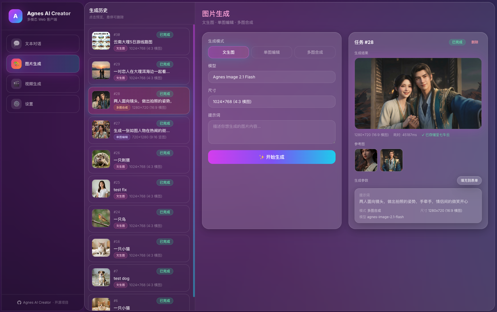

<h4 align="right"><a href="README_EN.md">English</a> | <strong>简体中文</strong></h4>
<p align="center">
  
</p>
<h1 align="center">灵动创影 · EnovaMotion</h1>
<p align="center"><strong>基于 Agnes AI 模型的多模态 AI 创作平台</strong></p>
<p align="center">文生图 / 图生图 · 文生视频 / 图生视频 </p>
<div align="center">
  <a href="https://platform.agnes-ai.com/" target="_blank">
  </a>
  <a href="https://agnes-ai.com/doc/overview" target="_blank">
  </a>
  <a href="https://nodejs.org/" target="_blank">
  </a>
  <a href="https://nestjs.com/" target="_blank">
  </a>
  <a href="https://nextjs.org/" target="_blank">
  </a>
  <a href="https://www.postgresql.org/" target="_blank">
  </a>
</div>

<p align="center">
  
</p>

<p align="center">
  <strong>生图 · 生视频 · 一个界面全搞定</strong><br/>
</p>

> 面向 Codex/Agent 的产品与工程文档入口：[`docs/README.md`](docs/README.md)；产品事实参考：[`docs/product-reference.md`](docs/product-reference.md)。

## 功能特性

| 模块 | 能力 |
|------|------|
| **账户与鉴权** | 注册 / 登录 / 登出、HttpOnly Cookie 会话、Turnstile 人机校验、用户角色（USER/ADMIN） |
| **图片生成** | 文生图、单图编辑、多图合成；多模型支持 |
| **视频生成** | 文生视频、图生视频、多图视频、关键帧动画；BullMQ 异步任务 + 延迟轮询 |
| **统一任务系统** | `GenerationJob` 统一建模图片 / 视频等生成任务，状态机 PENDING→QUEUED→RUNNING→SUCCEEDED/FAILED/CANCELED |
| **计费闭环** | Credits 钱包 + Reserve/Settle/Release 三段式结算、账本（Ledger）、幂等入账、防超卖 |
| **支付充值** | sandbox / 支付宝 / 微信 适配层，充值下单 → 回调验签 → 幂等入账 |
| **媒体存储** | 图片 / 视频结果自动转存七牛云 / S3，持久化历史记录，SSRF 防护 |
| **管理后台** | `/api/v1/admin/*`：Provider / Credential / User / Stats / Settings / 审计日志 / 系统更新 |
| **多工作区** | Workspace + 成员隔离（IDOR 防护），注册自动创建 Personal Workspace 与 Welcome Credits |

### 支持的模型

| 类型 | 模型 |
|------|------|
| 文本 | `agnes-2.0-flash`、`agnes-1.5-flash`（已弃用） |
| 图片 | `agnes-image-2.0-flash`、`agnes-image-2.1-flash` |
| 视频 | `agnes-video-v2.0` |

## 技术栈

- **前端**: Next.js 15（App Router）· React 19 · TypeScript · Tailwind CSS（`apps/web`）
- **API**: NestJS 11 + Fastify + TypeScript（`apps/api`）
- **Worker**: BullMQ 生成任务消费者（`apps/worker`）
- **数据库**: PostgreSQL 16 · Drizzle ORM（版本化 migration）
- **队列 / 缓存**: Redis + BullMQ
- **对象存储**: 七牛云 / AWS S3（可选，抽象为 `ObjectStorage` 接口）
- **AI 接口**: [Agnes AI OpenAI 兼容 API](https://agnes-ai.com/doc/overview)，经 `ProviderRegistry` + AES-GCM 加密凭证访问

## 架构概览

本项目是 **Modular Monolith（模块化单体）**，同一代码库里按 `apps/` 拆分三个独立进程，通过 `packages/*` 共享业务逻辑：

```text
Browser
  ↓
Web (Next.js :3000, apps/web)          # SSR + 静态页面，/api/v1/* rewrite 到 API
  ↓ /api/v1/*（服务端 rewrite）
API (NestJS :3001, apps/api)           # 鉴权 / 生成 / 计费 / 支付 / 管理后台
  ├── PostgreSQL (Drizzle)             # 数据持久化
  ├── Redis / BullMQ                   # 队列（enqueue 生成任务）
  ↓
Worker (apps/worker)                   # 消费 BullMQ：调用 Agnes → 轮询 → 转存 → 结算
  ├── ProviderRegistry + Credential    # AI Provider 抽象 + AES-GCM 加密凭证
  ├── ObjectStorage                    # 七牛云 / S3
  └── WalletGateway                    # 最终成功结算 / 失败释放保留 credits
```

### 目录结构

```
enova-video/
├── apps/
│   ├── api/                  # NestJS API（REST /api/v1 + OpenAPI）
│   ├── worker/               # BullMQ 生成任务消费者
│   └── web/                  # Next.js 15 前端（App Router）
├── packages/
│   ├── contracts/            # 跨进程共享类型 / 枚举 / 错误码 / 队列契约
│   ├── config/               # 环境变量校验（Zod）
│   ├── db/                   # Drizzle schema + migrations + client
│   ├── provider/             # AIProvider 抽象 + ObjectStorage + CredentialManager + SSRF
│   ├── billing/              # 钱包 / credits 领域逻辑（Reserve / Settle / Release）
│   ├── payment/              # 支付渠道抽象 + sandbox / 支付宝 / 微信 适配器
│   ├── sdk/                  # 由 openapi.json 生成的 TS 客户端
│   └── migrator/             # 旧 SQLite 数据迁移 CLI
├── scripts/                  # 生产更新 / 回滚脚本（update.sh / rollback.sh / lib.sh）
├── .github/workflows/        # ci / deploy / release
├── docker-compose.dev.yml    # 本地 PostgreSQL + Redis
└── docker-compose.prod.yml   # 生产 postgres + redis + api + worker + web
```

## 环境要求

- Node.js `>=20`
- pnpm `10.27.0`
- Docker（可选，用于本地 PostgreSQL / Redis 或生产部署）
- [Agnes AI API Key](https://platform.agnes-ai.com/)（在管理后台或数据库初始导入）

## 快速开始（本地开发）

### 1. 克隆项目

```bash
git clone https://github.com/jadelike-wine/enova-video.git
cd enova-video
```

### 2. 安装依赖并启动基础设施

```bash
pnpm install
docker compose -f docker-compose.dev.yml up -d   # 启动 PostgreSQL + Redis
cp .env.example .env                              # 按需配置
```

### 3. 启动开发进程

```bash
pnpm dev        # 并行启动所有新架构 workspace（api / worker / web）
```

也可以分别启动：

```bash
pnpm dev:api     # API，默认 http://localhost:3001
pnpm dev:worker  # 生成任务 worker
pnpm --filter @enova/web dev   # 前端，默认 http://localhost:3000
```

### 4. 数据库与 SDK

```bash
pnpm db:generate   # 生成 Drizzle migration
pnpm db:migrate    # 执行 PostgreSQL migration
pnpm sdk:generate  # 根据 apps/api/openapi.json 生成 SDK 类型
```

### 5. 首次使用

浏览器访问 [http://localhost:3000](http://localhost:3000) → 注册账号（自动创建 Personal Workspace + Welcome Credits）。Agnes AI 的 Provider 与凭证在管理后台配置（见下文）。

## 提交前验证

```bash
pnpm lint
pnpm typecheck
pnpm test
pnpm build
```

只改单个 workspace 时可用 `pnpm --filter <package> <script>` 缩小范围。

## 生产部署

生产使用 **GitHub Actions Release 构建的 GHCR 镜像**，通过 `docker-compose.prod.yml` 编排 `postgres + redis + api + worker + web` 五个服务。

### 架构拓扑

```text
Browser
  ↓
Reverse Proxy (Nginx / Caddy / Traefik)
  ↓ 3000
Web (Next.js standalone, ghcr.io/...-web)
  ↓ /api/v1/*（服务端 rewrite）
API (NestJS, ghcr.io/...-api :3001)
  ├── PostgreSQL 16（数据卷）
  ├── Redis 7（队列 / 缓存）
  ↓
Worker (ghcr.io/...-worker)
```

- **API** 启动前自动执行 Drizzle migration（幂等，失败即退出 → 健康检查失败 → 自动回滚）。
- **Web** 以 Next.js `output: 'standalone'` 运行，`/api/v1/*` rewrite 到 API。
- **Worker** 消费 BullMQ 队列，负责实际生成、轮询、转存与结算。

### 部署编排

```bash
# 先按下方“发布一个版本”流程更新 VERSION、提交并推送 main，再打 tag
git tag v1.2.0 && git push origin v1.2.0   # 触发 release.yml 构建并推送 GHCR 镜像
./scripts/update.sh v1.2.0                  # 在服务器上拉取并升级到指定版本
```

生产环境变量通过 `.env` 注入（见 `.env.example`），关键项：

| 变量 | 必填 | 说明 |
|------|------|------|
| `NEXT_PUBLIC_SITE_URL` | **可选** | 站点对外访问的完整域名，构建时 fallback；运行时从管理员后台系统设置读取 |
| `DATABASE_URL` | **是** | PostgreSQL 连接串 |
| `REDIS_URL` | **是** | Redis 连接串 |
| `CREDENTIAL_MASTER_KEY` | **是** | AES-GCM 加密 Provider Secret 的 32 字节 Master Key（`openssl rand -hex 32`） |
| `STORAGE_PROVIDER` | 否（兼容 fallback） | `aws_s3` / `qiniu` / `none`，默认 `aws_s3`；推荐在管理员后台设置 |
| `WELCOME_CREDITS` | 否（兼容 fallback） | 注册发放的 Welcome Credits，默认 `100`；推荐在管理员后台设置 |
| `PAYMENT_MODE` | 否 | `sandbox` / `alipay` / `wechat`，默认 `sandbox` |

> **安全**：生产禁止使用 `.env.example` 中的 dev 占位密钥；`CREDENTIAL_MASTER_KEY`、数据库和 Redis 只能通过服务端环境或 IAM / Role 注入。对象存储凭证可在管理员后台加密保存，未配置时才回退到服务端环境或 IAM / Role。

## 对象存储

灵动创影支持 **AWS S3**、七牛云和不使用对象存储。Provider、桶、凭证和日志配置可在管理员后台「系统设置 → 存储配置」中动态修改并立即生效。首次启动或数据库没有对应配置时，才回退到环境变量；存储未配置完整时系统保持可运行并暂时不转存对象。业务代码只依赖 `packages/provider` 的 `ObjectStorage` 抽象接口。

### 使用 Access Key 部署

```bash
STORAGE_PROVIDER=aws_s3
AWS_REGION=ap-southeast-1
AWS_S3_BUCKET=my-bucket
AWS_ACCESS_KEY_ID=你的AccessKey
AWS_SECRET_ACCESS_KEY=你的SecretKey
```

### 使用 IAM Role 部署（推荐生产）

无需在配置中填写密钥，服务通过 EC2 Instance Profile / ECS Task Role / EKS IAM Role 获取凭据：

```bash
STORAGE_PROVIDER=aws_s3
AWS_REGION=ap-southeast-1
AWS_S3_BUCKET=my-bucket
AWS_S3_PREFIX=agnes-ai
```

### 最小 IAM Policy

```json
{
  "Version": "2012-10-17",
  "Statement": [
    {
      "Effect": "Allow",
      "Action": ["s3:PutObject", "s3:GetObject"],
      "Resource": "arn:aws:s3:::YOUR_BUCKET/agnes-ai/*"
    }
  ]
}
```

### 私有 Bucket（presigned URL）

数据库只保存稳定的对象 key（`storage_provider` + `object_key`），不落会过期的 presigned URL；读取历史时 API 动态生成有效期 1 小时的 presigned GET URL。

### 对象 Key 规范

```text
{prefix}/images/{yyyy}/{mm}/{dd}/{uuid}.{ext}
{prefix}/videos/{yyyy}/{mm}/{dd}/{uuid}.{ext}
```

### 容错

对象存储是附加能力：转存失败会降级保留 Agnes 原始 URL 并记录日志，不会把 AI 生成结果判为失败。

## 变更记录

详细版本变更见 [CHANGELOG.md](CHANGELOG.md)。

## 版本发布、更新与回滚

> 目标：**版本化发布（SemVer）+ 手动执行更新 + PostgreSQL 备份 + 真实健康检查 + 失败自动回滚 + 可人工回滚**。
> 默认**禁止无人值守自动升级**生产；任何生产升级前必须有数据库备份；任何新版本必须通过真实 Health Check 才判定成功。

### 版本与镜像

- 根目录 `VERSION` 记录当前 SemVer（如 `1.2.0`）；Git Tag 带 `v` 前缀（`v1.2.0`），镜像 tag 不带 `v`。
- Docker 镜像使用明确版本 tag，禁止依赖 `latest` 升级/回滚：

```text
ghcr.io/jadelike-wine/enova-video-api:1.2.0
ghcr.io/jadelike-wine/enova-video-worker:1.2.0
ghcr.io/jadelike-wine/enova-video-web:1.2.0
ghcr.io/jadelike-wine/enova-video-deploy-tool:1.2.0
```

- 额外提供 `latest` 与 `sha-<commit>` tag，仅用于快速拉取；生产更新/回滚一律用明确版本或 digest。
- 构建时注入 `APP_VERSION` / `GIT_SHA` / `BUILD_TIME`，API 可通过接口查询。

### 发布一个版本

> **顺序至关重要**：必须先 bump `VERSION` 并提交，确认 push 到远程后再打 tag。
> `release.yml` 会校验 `VERSION` 文件与 tag 是否一致，不一致则立即失败。

```bash
# 1. bump VERSION（必须与将要打的 tag 一致，不带 v 前缀）
echo "1.2.0" > VERSION

# 2. 更新 CHANGELOG.md（添加对应版本的变更记录）

# 3. 提交并推送到 main
git add VERSION CHANGELOG.md
git commit -m "chore: bump VERSION to 1.2.0 and update changelog"
git push origin main

# 4. 打 tag 并推送（tag 指向已包含正确 VERSION 的 commit）
git tag v1.2.0
git push origin v1.2.0
```

推送 `v*` tag 会触发 GitHub Actions `release.yml`：校验 VERSION 与 tag 一致 → 编译测试 → 登录 GHCR → 构建并推送 api / worker / web / deploy-tool（`linux/amd64`）→ 生成 `release.json`（版本 / Git SHA / 镜像 / digest）→ 创建 GitHub Release。

> 如果 release 因 VERSION 不匹配而失败，需要删除远程和本地 tag，修正 VERSION 后重新打 tag：
> ```bash
> git tag -d v1.2.0 && git push origin :refs/tags/v1.2.0
> # 修正 VERSION 后重新提交、打 tag、推送
> ```

### 检查更新（手动）

管理后台 **设置 → System Update → Check for Updates**。页面只做「检查」，绝不自动升级。API 接口：

```http
GET /api/v1/admin/system-update/check
```

默认只检查 **stable** release；GitHub API 故障只影响本次检查，不影响主应用。

### 升级到指定版本

```bash
./scripts/update.sh           # 升级到最新 stable
./scripts/update.sh v1.2.0   # 升级到指定版本
./scripts/update.sh --dry-run # 只查看升级计划，不修改任何东西
```

升级流程（任一步失败即中止，旧版本继续运行）：

```text
lock → 确定目标版本 → 预检(Docker/Compose) → 当前健康检查
→ PostgreSQL 一致性备份 → 保存 deployment state → pull 新镜像
→ 校验 digest → 切换 APP_VERSION → docker compose up -d --no-build
→ 全链路健康检查(api /health + web /)
→ 成功记录；失败自动回滚
```

### 代码回滚（推荐，保留当前数据库）

```bash
./scripts/rollback.sh --code-only
```

只回滚 api / worker / web 到上一个成功版本，**不**改动数据库（避免丢失新数据）。

### 完整回滚（代码 + 恢复旧数据库）

```bash
./scripts/rollback.sh --restore-db
```

会恢复 pre-update PostgreSQL 备份，**会删除备份时间点之后产生的所有新数据**，脚本会要求确认。

> **数据丢失风险**：`--restore-db` 会把数据库恢复到升级前快照；新版本已运行一段时间并产生新数据时，请优先使用 `--code-only`。

### 更新 / 回滚日志与部署状态

- 所有 update/rollback 都带唯一 `update_id`，日志保存到 `.deploy/logs/`。
- `.deploy/` 保存 `state.json`（previous/current 版本与 digest、备份路径、update_id）、`history.json`、`version.env`（仅 `APP_VERSION`）、`update.lock`。**绝不存 Secret**。

### GitHub Actions 手动部署 / 回滚

`deploy.yml` 仅允许 `workflow_dispatch` 手动触发（不随 push 自动部署生产），通过 SSH 调用服务器脚本：

| 输入 | 说明 |
|------|------|
| `action` | `deploy`（部署）或 `rollback`（回滚） |
| `version` | 仅 deploy 生效。如 `v1.2.0`；留空则升级到最新 stable |
| `restore_db` | 仅 rollback 生效。`false`（默认，code-only）或 `true`（恢复旧数据库） |

**需要配置的 Secrets**（建议放在 `production` Environment Secrets）：

```text
DEPLOY_HOST      # 服务器 IP / 域名
DEPLOY_PORT      # SSH 端口，默认 22
DEPLOY_USER      # SSH 用户名
DEPLOY_SSH_KEY   # SSH 私钥（github 账号可用的）multiline
DEPLOY_PATH      # 服务器上仓库克隆路径（如 /opt/enova-video）
```

### 服务器需要哪些配置

- Docker（含 Compose 插件）、能访问 GHCR。
- 克隆仓库到 `DEPLOY_PATH`，`cp .env.example .env` 并填写 Postgres / Redis / Agnes / 存储等配置。
- GHCR 镜像为 private 时，服务器需 `docker login ghcr.io` 并配置只读 token。
- 更新脚本内置锁（flock），update 与 rollback 互斥。

## 日志与故障排查

应用日志（api / worker / web）统一输出到 **stdout / stderr**，不写入容器内 `.log` 文件，直接用 `docker compose logs`（或 `docker logs <container>`）即可查看。

### 日志配置

通过管理员后台「系统设置 → 日志 / 可观测性」动态控制（默认值见系统设置注册表）；旧部署仍可使用 `.env` 作为 fallback：

| 变量 | 说明 | 默认 |
|------|------|------|
| `LOG_LEVEL` | `DEBUG` / `INFO` / `WARNING` / `ERROR` / `CRITICAL` | `INFO` |
| `LOG_FORMAT` | `text`（人读）/ `json`（接 CloudWatch / Loki / ELK） | `text` |
| `LOG_PROMPTS` | 是否记录用户 prompt | `false` |
| `ACCESS_LOG` | 是否输出请求访问日志 | `true` |

### 常用日志查询命令

```bash
docker compose logs -f api            # 跟踪 API 日志
docker compose logs -f worker         # 跟踪 Worker 日志
docker compose logs worker | grep "abc123"     # 按 Request ID 查调用链
docker compose logs worker | grep "task_id=xxx" # 按生成任务 ID 查生命周期
docker compose logs api | grep "ERROR"          # 只查错误
```

### 如何定位常见问题

| 现象 | 重点搜索字段 / 特征 |
|------|----------------------|
| Agnes 401（Key 无效/过期） | `AGNES_UNAUTHORIZED` 或 `status=401` |
| Agnes 429（限流） | `AGNES_RATE_LIMITED` 或 `status=429`、`retry_after` |
| Agnes 超时 | `AGNES_TIMEOUT`、`type=timeout`、`retry_count` |
| 凭证并发 / 冷却 | `CREDENTIAL_*`、`COOLDOWN`、错误码前缀 |
| 视频轮询超时 | `pollCount` 达到上限、`VIDEO_MAX_POLLS` |
| 钱包 / 结算异常 | `wallet`、`idempotency_key`、`GENERATION_SETTLE/RELEASE` |
| API 未健康 | `docker compose ps` 中 api 不是 healthy；查 `health` 相关日志 |
| Web 无法代理 API | web 日志中 `upstream` / `ECONNREFUSED` / `502` |

### Request ID 与 Task ID 追踪

- 每个 HTTP 请求都带 `request_id`（前端生成并透传 `X-Request-ID`，API 也自动生成），响应头回传，错误响应体包含 `request_id` 与 `error_code`。
- 生成任务记录 `task_id`（`generation_jobs.id`）与 `provider_job_id`（上游任务 ID），worker 用其串联：提交 → 轮询 → 完成/失败 → 下载 → 转存 → 结算。

## API 文档

API 为 **NestJS + Fastify**，路由统一前缀 `/api/v1`。运行 `apps/api` 后访问 Swagger 文档（Fastify 下对应 OpenAPI JSON，见 `apps/api/openapi.json`）。

### 鉴权

| 方法 | 路径 | 说明 |
|------|------|------|
| POST | `/api/v1/auth/register` | 注册（自动创建 Personal Workspace + Welcome Credits） |
| POST | `/api/v1/auth/login` | 登录（HttpOnly Cookie 会话） |
| POST | `/api/v1/auth/logout` | 登出 |
| GET | `/api/v1/auth/me` | 当前用户信息 |
| GET | `/api/v1/auth/turnstile-config` | Turnstile 人机校验配置 |

### 生成任务

| 方法 | 路径 | 说明 |
|------|------|------|
| POST | `/api/v1/generations` | 提交生成任务（图片 / 视频） |
| GET | `/api/v1/generations` | 任务历史 |
| GET | `/api/v1/generations/:id` | 任务详情与结果 |
| POST | `/api/v1/generations/:id/cancel` | 取消任务 |

### 计费与支付

| 方法 | 路径 | 说明 |
|------|------|------|
| GET | `/api/v1/billing/wallet` | 钱包余额与预留 |
| GET | `/api/v1/billing/ledger` | 钱包账本流水 |
| POST | `/api/v1/payment/recharge` | 充值下单 |
| POST | `/api/v1/payment/notify/:channel` | 支付回调验签入账 |
| POST | `/api/v1/payment/sandbox/:orderId/confirm` | sandbox 模拟确认 |

### 管理后台（`/api/v1/admin/*`，需 ADMIN 角色）

| 资源 | 说明 |
|------|------|
| `/admin/providers` | Provider CRUD |
| `/admin/providers/:providerId/credentials` | Provider 凭证管理 |
| `/admin/users` | 用户管理（状态 / 发放 credits） |
| `/admin/stats` | 业务统计 |
| `/admin/settings` | 动态配置 |
| `/admin/audit-logs` | 审计日志 |
| `/admin/system-update` | 系统更新 / 回滚 |

### 健康检查

| 方法 | 路径 | 说明 |
|------|------|------|
| GET | `/api/v1/health` | 存活检查 |
| GET | `/api/v1/health/ready` | 就绪检查 |

## 数据库

新架构使用 **PostgreSQL 16 + Drizzle ORM**，schema 定义在 `packages/db/src/schema.ts`，版本化 migration 在 `packages/db/drizzle/`。

主要数据表：

| 域 | 表 | 用途 |
|------|------|------|
| Identity | `users` / `sessions` | 用户与会话（HttpOnly Cookie） |
| Workspace | `workspaces` / `workspace_members` | 工作区与成员隔离 |
| Generation | `generation_jobs` / `assets` | 统一生成任务与产物 |
| Provider | `providers` / `provider_credentials` | Provider 与 **AES-GCM 加密**凭证 |
| Billing | `wallets` / `wallet_ledger` | 钱包余额 / 预留 / 账本（幂等） |
| Pricing | `pricing_rules` / `usage_events` | 定价规则与用量 |
| Payment | `orders` / `payment_transactions` | 充值订单与支付流水 |
| Admin | `admin_audit_logs` / `settings` | 审计日志与动态配置 |
| Legacy | `legacy_migration` | 旧 SQLite 数据迁移归集 |

### 金额约定（避免浮点误差）

- `credits`：整数（bigint），单位 = 1 credit。
- `*_cost_usd`：整数（integer），单位 = 微美元（1e-6 USD），即 1 USD = 1_000_000。
- 所有金额计算必须使用整数运算。

## 项目结构

```
enova-video/
├── apps/
│   ├── api/                     # NestJS API（/api/v1 + OpenAPI）
│   │   └── src/
│   │       ├── auth/            # 注册 / 登录 / 会话 / Turnstile
│   │       ├── generations/     # 生成任务
│   │       ├── billing/         # 钱包 / 定价
│   │       ├── payment/         # 充值 / 回调
│   │       ├── admin/           # 管理后台（Provider / User / Stats / Audit / System-update）
│   │       ├── settings/        # 动态配置
│   │       ├── health/          # 健康检查
│   │       └── app.module.ts    # 应用装配
│   ├── worker/
│   │   └── src/
│   │       ├── generation/      # pipeline / repo / state
│   │       └── processors/      # BullMQ 消费者
│   └── web/
│       ├── app/                 # 营销页 + /app 交互区 + /auth + /docs + /models
│       ├── components/          # marketing/ + application/ + auth/
│       └── lib/                 # api.ts / seo.ts / models.ts / auth.tsx ...
├── packages/
│   ├── contracts/               # 类型 / 枚举 / 错误码 / 队列契约
│   ├── config/                  # env 校验（Zod）
│   ├── db/                      # Drizzle schema + migrations
│   ├── provider/                # AIProvider + ObjectStorage + CredentialManager + SSRF
│   ├── billing/                 # 钱包 / credits 领域逻辑
│   ├── payment/                 # 支付抽象 + sandbox / alipay / wechat
│   ├── sdk/                     # OpenAPI 生成客户端
│   └── migrator/                # 旧 SQLite 迁移工具
├── scripts/                     # update.sh / rollback.sh / lib.sh
├── .github/workflows/           # ci / deploy / release
├── docker-compose.dev.yml       # 本地 PostgreSQL + Redis
└── docker-compose.prod.yml      # 生产 postgres + redis + api + worker + web
```
